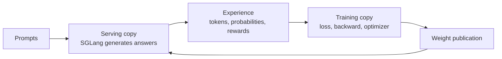
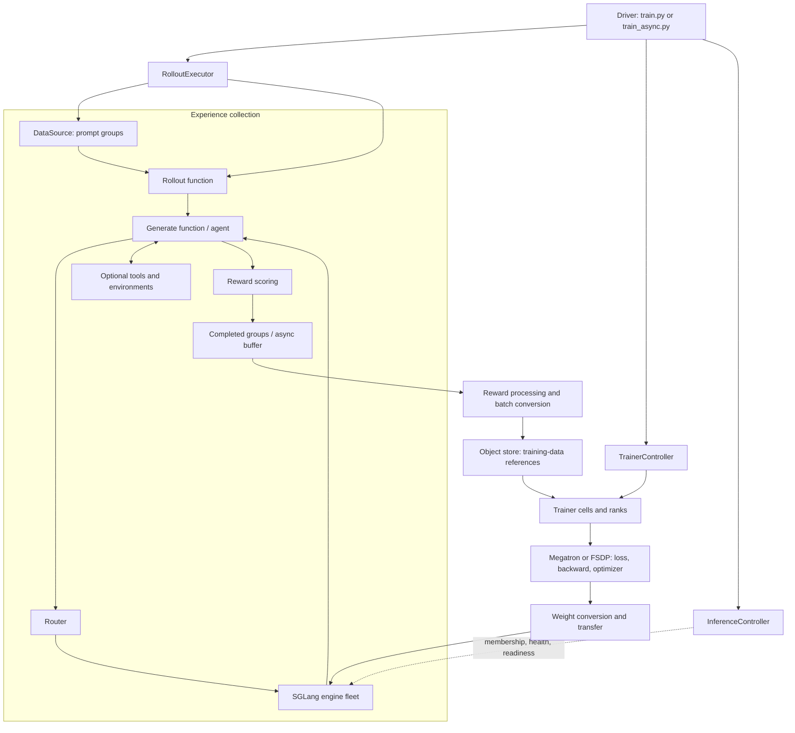
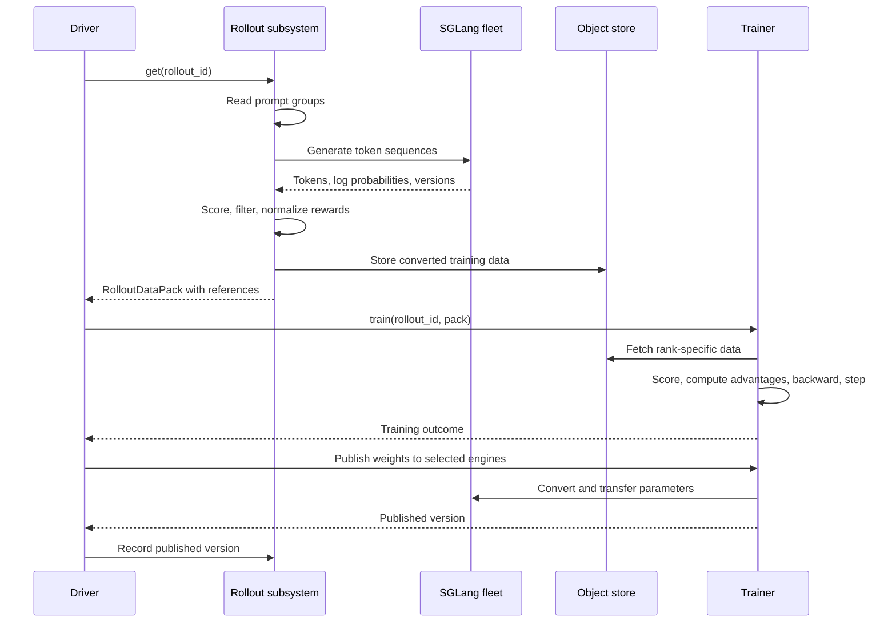

Miles connects a system that **collects experience** to a system that **learns from that experience**. This book builds that idea into a working understanding of the codebase, one component at a time.

You will first learn what the system must accomplish, then follow one small training iteration, then open the implementation behind each stage. Distributed execution and asynchronous scheduling come after the ordinary learning loop is familiar. The final chapters extend that loop to agents, evaluation, and custom tasks.

## How to read this book

Read the chapters in order on your first pass. Each chapter starts with a learning goal, explains the concept, connects it to Miles, and ends with a short source-reading lab and two questions. The [answer key](#appendix-b-checkpoint-answers) is separate so you can test your understanding before seeing the explanation.

You need basic Python, a rough understanding of autoregressive language models, and the idea that gradient descent changes model parameters to reduce a loss. You do not need prior knowledge of Ray, Megatron, FSDP, or reinforcement-learning algorithms. The first three chapters require no code reading. The source labs can be completed with an editor and this checkout; running a training recipe requires its documented GPU environment.

The prose is the main path through the book. Source labs are a second pass through the same idea in code. Open only the named function at first; follow its helpers when the chapter gives you a reason to. The [repository map](#appendix-a-repository-map) is a reference to return to as you learn the components.

### The running example

We will train a small hypothetical math policy with these teaching settings:

| Setting | Value | Meaning |
|---|---|---|
| Prompts per collection | 2 | Two different questions, A and B. |
| Attempts per prompt | 4 | Four independent answers to each question. |
| Trajectories collected | 8 | Two prompt groups of four. |
| Global training batch | 8 | One optimizer step consumes the eight trajectories. |
| Initial schedule | Synchronous | Collect, train, publish, then repeat. |
| Reward | 1 or 0 | The answer is correct or incorrect. |

These are invented examples for tracing the program, not recorded outputs or a tested GPU recipe. We initially assume one training sample per trajectory, no dropped groups, and exact batch divisibility. Later chapters deliberately relax those assumptions. When a chapter changes a setting, it says so.

### Contents and progression

| Part | Chapters | What you will be able to explain |
|---|---|---|
| I. Build the mental model | 1–3 | Why the loop exists and what crosses each major boundary. |
| II. Open the core components | 4–7 | How prompts become token data, losses, gradients, and published weights. |
| III. Distribute and overlap the work | 8–10 | How workers coordinate and how async execution changes data freshness. |
| IV. Operate and extend the system | 11–14 | How to reason about agents, evaluation, recovery, customization, and debugging. |

Read the chapters in this order:

1. [Why reinforcement learning needs a system](#chapter-1-why-reinforcement-learning-needs-a-system)
2. [Two model copies and one learning loop](#chapter-2-two-model-copies-and-one-learning-loop)
3. [Follow one complete iteration](#chapter-3-follow-one-complete-iteration)
4. [Collecting experience from prompts](#chapter-4-collecting-experience-from-prompts)
5. [Turning rewards into a learning signal](#chapter-5-turning-rewards-into-a-learning-signal)
6. [Executing a training batch on GPUs](#chapter-6-executing-a-training-batch-on-gpus)
7. [Publishing the updated policy](#chapter-7-publishing-the-updated-policy)
8. [Mapping the components onto processes](#chapter-8-mapping-the-components-onto-processes)
9. [Keeping rollout and training busy](#chapter-9-keeping-rollout-and-training-busy)
10. [Learning from changing policies](#chapter-10-learning-from-changing-policies)
11. [From answers to tool-using agents](#chapter-11-from-answers-to-tool-using-agents)
12. [Evaluating and preserving progress](#chapter-12-evaluating-and-preserving-progress)
13. [Adapting the loop to a new task](#chapter-13-adapting-the-loop-to-a-new-task)
14. [A guided investigation of a real recipe](#chapter-14-a-guided-investigation-of-a-real-recipe)

**Source edition.** The implementation descriptions and source links refer to revision `23d41d711f3b80544fda655898ed4f051ed644fe`, inspected on September 26, 2026. The [Miles v0.1 announcement](https://www.lmsys.org/blog/2026-08-18-miles-v0-1) motivates the rollout–training–weight-publication loop; this book follows the local implementation of that loop. It focuses on LLM post-training. Diffusion has documentation here but a separate implementation. This is a source-based educational review; GPU training was not executed to produce the book.

## Part I. Build the mental model

In these chapters, treat generation, training, and publication as three boxes. Learn their inputs and outputs before learning the classes inside them.

### Chapter 1. Why reinforcement learning needs a system

**Learning goal:** Explain what experience collection contributes to learning, and why a reward is different from a target answer.

Imagine that you want an existing language model to solve more math questions correctly. You already have model weights. The question is how to use feedback from its own attempts to improve those weights.

In supervised fine-tuning, a dataset already contains the answer you want the model to produce. Training increases the probability of those target tokens.

In reinforcement learning, the model first produces an answer or performs a task. A reward function evaluates the result. Training then changes the model so that more rewarding behavior becomes more likely.

For a math task, one iteration might be:

1. Read a question from the dataset.
2. Generate several independent answers using the current policy.
3. Check each answer against the label.
4. Compare their rewards to obtain an advantage signal.
5. Increase the probability of tokens in better answers and decrease it in worse answers, subject to the configured objective.
6. Give the updated model weights to the generation engines.

For a coding agent, step 2 becomes a multi-turn interaction: generate a tool call, execute it in a sandbox, observe the result, and generate the next action. The reward might come from a test suite at the end.

#### The running example: score attempts, then compare them

For question A, “What is 2 + 2?”, imagine the four attempts end with `4`, `4`, `5`, and `3`. A verifier assigns rewards `[1, 1, 0, 0]`. For question B, “What is 3 × 3?”, imagine rewards `[0, 1, 0, 1]`.

The verifier gives a score to a completed answer. It does not directly provide a gradient for every token. The training algorithm must turn those scores into a differentiable objective for the policy. That is the job of the advantage and policy-loss calculations we will open in Chapter 5.

For now, remember the division: **the reward says how an attempt went; the training objective says how to change the model because of it**. A successful trajectory can contain unnecessary or incorrect intermediate reasoning, so a trajectory-level reward is a relatively coarse learning signal.

#### The vocabulary you need now

| Term | Meaning |
|---|---|
| Policy | The language model whose behavior we want to improve. |
| Rollout or trajectory | One execution of that policy on a task. |
| Prompt group | Several independent attempts at the same prompt. |
| Reward | Feedback on an attempt, from a verifier, environment, rule, or reward model. |
| Advantage | A comparison against a baseline that tells learning which behavior to favor. |
| Optimizer step | An update of trainable parameters using computed gradients. |

In our example there are two prompts, two groups, eight trajectories, and one optimizer step. Those counts describe different things. Keeping their units separate will make the later batching code much easier to read.

#### Source lab

Optional on the first pass: open [reward dispatch][reward-dispatch] and find the `math` branch in `async_rm()`. Notice its input is a generated `Sample` and its result is a score. There is no optimizer call here.

#### Check your understanding

1. Why does producing eight answers not, by itself, improve the model?
2. Which number in the running example counts independent attempts: 2, 4, or 8?

[Check the answers](#chapter-1-answers) after trying both questions.

We now have the ingredients of learning. Next we will place them into a system that can generate experience and update a model efficiently.

**Continue:** [Chapter 2: Two model copies and one learning loop](#chapter-2-two-model-copies-and-one-learning-loop) · **Back:** [How to read this book](#how-to-read-this-book)

### Chapter 2. Two model copies and one learning loop

**Learning goal:** Draw the generation–learning–publication loop and distinguish experience data from model weights.

The same policy has two jobs with different execution needs. During rollout it generates tokens efficiently. During training it participates in a differentiable computation that updates parameters. Miles gives those jobs to different backend implementations.

#### The smallest useful architecture



**SGLang owns serving.** It accepts token-generation requests and returns completions and metadata. **Megatron or FSDP owns training.** It computes the loss and updates the policy. Miles provides the orchestration, trajectory handling, and parameter-transfer machinery that connects them.

“Two copies” describes their logical roles. They can live on separate GPU fleets or take turns on the same GPU allocation. Some configurations also need a reference model, critic, or teacher; those roles are introduced when we reach the objective.

Experience flows from serving to training. Updated weights flow in the opposite direction. The experience includes the tokens actually generated and the information needed to interpret them. Publishing weights changes what serving will do on subsequent requests.

#### Why the two sides need an explicit handoff

Suppose training has just learned from question A. The trainer's parameters have changed, but SGLang is a separate serving implementation with its own parameters. Until publication updates that serving state, new answers still use its previous weights.

Likewise, training needs more than the readable answer “4.” It needs the token sequence, which tokens should carry loss, the reward, and—depending on the objective—the probabilities under the generating policy.

These handoffs are the central engineering problem. The two copies must agree about what the data means, even when their tensor layouts, kernels, or execution times differ.

#### The driver gives the loop its cadence

A driver asks the rollout subsystem for data, asks the training subsystem to learn from it, and arranges weight publication. It also decides when to save and evaluate. The starting point is [`train.py`][sync-driver].

On your first reading, recognize just three calls:

```text
rollout_executor.get(...)  -> obtain experience
actor_model.train(...)     -> update the training policy
update_weights(...)       -> publish the policy to serving
```

The controller and worker objects behind these calls can wait until Chapter 8. The code is already organized so that the outer loop can be understood before its distributed implementation.

#### Source lab

Optional: open [`train.py`][sync-driver], find `for rollout_id in range(...)`, and locate the three operations above. Ignore checkpointing, memory management, and the critic branch for now.

#### Check your understanding

1. What crosses the boundary from serving to training?
2. Why is the serving policy not automatically updated by `optimizer.step()`?

[Check the answers](#chapter-2-answers) after trying both questions.

The architecture is a loop because each update changes the distribution of future experience. We can now walk around it once with actual counts and artifacts.

**Continue:** [Chapter 3: Follow one complete iteration](#chapter-3-follow-one-complete-iteration) · **Back:** [Chapter 1: Why reinforcement learning needs a system](#chapter-1-why-reinforcement-learning-needs-a-system)

### Chapter 3. Follow one complete iteration

**Learning goal:** Trace one iteration without needing to understand every class or distributed operation.

Return to the two math prompts and four attempts per prompt. Keep the schedule synchronous: finish collecting this iteration, train on it, and publish before collecting the next one.

#### An iteration as a sequence of artifacts

| Stage | What happens in the running example | What leaves the stage |
|---|---|---|
| 1. Select tasks | Read prompts A and B and create four attempts for each. | Two groups of pending samples. |
| 2. Generate | Serving produces eight answers. | Exact token sequences and generation metadata. |
| 3. Score | A receives `[1, 1, 0, 0]`; B receives `[0, 1, 0, 1]`. | Completed samples with rewards. |
| 4. Prepare data | Preserve groups for reward processing, then prepare training fields and masks. | A batch representing eight trajectories. |
| 5. Learn | Compare attempts, compute the loss, accumulate gradients, and update parameters. | A new training policy after one optimizer step. |
| 6. Publish | Transfer that policy to serving. | A new serving weight version. |

There are several representations of “the batch” along this path. It begins as Python objects describing tasks. It acquires token-level results. It becomes data stored for the trainer. Finally, the backend constructs GPU tensors and microbatches. The next four chapters open these transformations in order.

#### What changes and what remains evidence

The optimizer changes trainable parameters. It does not rewrite the historical reward or the probability recorded when an answer was generated. Those values describe an already completed event.

The serving version changes when weights are published. The dataset position changes when prompts are read. The batch's object-store references are released after training is done with them. These are separate state transitions, with separate owners.

This explains why “step” needs a qualifier. Our teaching configuration has one collection, one optimizer step, and one publication per iteration. A real recipe can have several optimizer steps per collection or publish only every few iterations.

#### The loop with the details temporarily hidden

The following is explanatory pseudocode:

```text
initialize rollout and training
establish the starting serving weights

repeat:
    experience = collect_and_score_two_prompt_groups()
    training_batch = prepare(experience)
    learn_from_eight_trajectories(training_batch)
    publish_updated_weights()
```

A useful prediction follows: if generation becomes slower, the synchronous trainer waits longer; if training becomes slower, serving waits longer before the next collection. Chapter 9 will change this schedule while preserving the data and learning contracts.

For now, make sure you can point to where answers appear, where rewards appear, where gradients appear, and where serving changes. Those four locations are the foundation for reading the implementation.

#### Source lab

Without following helpers, annotate [`train.py`][sync-driver] with the six stages in the table. You will find generation, scoring, and preparation packaged behind `rollout_executor.get()`. Mark that boundary as the first component to open.

#### Check your understanding

1. If global batch size changes from eight to four and nothing is dropped, how many optimizer steps consume this collection?
2. Does the old answer become a sample from the new policy after weight publication?

[Check the answers](#chapter-3-answers) after trying both questions.

You have completed the high-level view. Part II follows the same order, but replaces each box with its concrete data structures and functions.

**Continue:** [Chapter 4: Collecting experience from prompts](#chapter-4-collecting-experience-from-prompts) · **Back:** [Chapter 2: Two model copies and one learning loop](#chapter-2-two-model-copies-and-one-learning-loop)

## Part II. Open the core components

Follow the data downstream: task selection, generation, learning signal, GPU execution, and weight publication. Keep the eight trajectories from Part I in mind. Each chapter opens one boundary that the previous chapter left abstract.

### Chapter 4. Collecting experience from prompts

**Learning goal:** Explain how a dataset row becomes a scored `Sample`, and identify the fields the trainer will need.

Chapter 3 hid collection behind one operation. The rollout executor actually owns a data source and a selected rollout implementation. The data source chooses work; the generator produces trajectories; reward code finishes the experience.

#### The executor owns the collection boundary

`RolloutExecutor.get()` is the driver-facing entry point. Its configured rollout function obtains samples from the data source, calls generation and reward code, and returns grouped experience. The executor subsequently converts that experience for the trainer.

There are two rollout APIs in the tree. The default class-based path uses `InferenceRolloutFn`; fully async later selects `FullyAsyncRolloutFn`. The legacy `sglang_rollout.py` path is selected through `MILES_USE_LEGACY_ROLLOUT_V1`. Begin with the default path. [`resolve_rollout_function_paths()`][arguments] shows how selection works.

#### First: create the prompt groups

`RolloutDataSource.get_samples(2)` reads two prompts and deep-copies each four times. It assigns:

- a common `group_index` to the responses for one prompt;
- a distinct `index` to each independent rollout sample.

The initial structure is:

```text
[
    [prompt_A_try_0, prompt_A_try_1, prompt_A_try_2, prompt_A_try_3],
    [prompt_B_try_0, prompt_B_try_1, prompt_B_try_2, prompt_B_try_3],
]
```

`RolloutDataSourceWithBuffer` first checks recycled groups before reading fresh prompts. That buffer contains work to submit or retry. It is separate from the fully async buffer of already completed, scored groups. Read [`data_source.py`][data-source] with that distinction in mind.

#### Second: understand the object being filled

[`Sample`][sample-types] is the most useful data structure to learn early.

| Field | Meaning |
|---|---|
| `prompt`, `label`, `metadata` | Task input, expected answer or grading input, and integration-specific information. |
| `tokens` | The full token sequence used for training: prompt plus response region. |
| `response` | Human-readable output, useful for reward functions and inspection. |
| `response_length` | Length of the response region at the end of `tokens`. In a multi-turn sample, that region may include tool/environment tokens. |
| `loss_mask` | One entry per response-region token; marks which tokens contribute to the loss. |
| `reward` | Scalar or dictionary of scores; `reward_key` can choose one value. |
| `rollout_log_probs` | Response-aligned log probabilities recorded from serving. |
| `weight_versions` | Version spans tied to absolute token positions, grouped by generation call. |
| `rollout_routed_experts` | Optional MoE routing decisions for replay. |
| `rollout_sampling_mask` | Optional record of sampling support, for replaying restricted distributions. |
| `status` | Pending, completed, truncated, aborted, or failed. |
| `rollout_id` | Shared execution identity when one episode yields multiple training samples. |

For a simple invented token sequence:

```text
tokens          = [101, 102, 103, 201, 202, 203]
                    prompt       generated response
response_length = 3
loss_mask       = [1, 1, 1]
rollout_log_probs= [log p(201), log p(202), log p(203)]
```

The loss for token `201` uses the logits predicting the token after prefix `[101, 102, 103]`. The backend's logit-processing code handles the next-token offset. Mask and probability alignment must survive packing and context-parallel slicing.

Focus first on `tokens`, `response_length`, `loss_mask`, and `reward`. Version spans, expert replay, and sampling support will become important in Chapter 10. An ordinary single-turn attempt has one `Sample`; multi-sample agent episodes arrive in Chapter 11.

#### Third: generate and score

The common rollout path calls `generate_and_rm_group()`, which creates concurrent `generate_and_rm()` tasks for the group's samples.

For each sample, `generate_and_rm()`:

1. Acquires the generation semaphore.
2. Calls the selected generate function with `GenerateFnInput`.
3. Receives one `Sample`, or several samples from a branching/compacting episode.
4. Calculates missing rewards, unless reward evaluation is deferred to the entire group.

The default [single-turn generator][single-turn] computes prompt token IDs, sends a request to the router's `/generate` endpoint, and fills the sample from the response. Generation returns token-level data as well as display text. [Reward dispatch][reward-dispatch] supports built-in scorers, a custom async function, and a remote reward service. An environment can also set the reward during generation.

The entry points to read are [`generate_and_rm()` and `generate_and_rm_group()`][rollout-common].

#### Return to question A

The four copies of question A share a prompt-group identity but have distinct sample indices. After generation, each holds its own response tokens. After scoring, their rewards are `[1, 1, 0, 0]`.

The readable response helps the verifier decide correctness. The token fields let training reproduce the context for a probability calculation. Both representations are useful, but they have different consumers. A custom generator must preserve their relationship.

#### Source lab

Read [`RolloutDataSource.get_samples()`][data-source], then [`single_turn.generate()`][single-turn], then [`generate_and_rm()`][rollout-common]. In an editor, make a three-column note: field, where it is first set, and who later consumes it. Start with `group_index`, `tokens`, and `reward`.

#### Check your understanding

1. Why do the four attempts for A share `group_index` but need different `index` values?
2. For six total tokens and a response length of three, how many entries should the response `loss_mask` contain?

[Check the answers](#chapter-4-answers) after trying both questions.

The sample now records what happened. The next component must decide how that experience should change the policy.

**Continue:** [Chapter 5: Turning rewards into a learning signal](#chapter-5-turning-rewards-into-a-learning-signal) · **Back:** [Chapter 3: Follow one complete iteration](#chapter-3-follow-one-complete-iteration)

### Chapter 5. Turning rewards into a learning signal

**Learning goal:** Connect rewards, advantages, fixed probability data, and the differentiable policy loss.

We have eight completed samples. Before worrying about how they fit on GPUs, establish what learning from them means mathematically. Follow one successful and one unsuccessful answer to question A.

#### From a score to an advantage

A reward of one tells us an answer was correct. An advantage compares it with a baseline. In the running example, a correct answer is better than the average attempt at that prompt, while an incorrect one is worse.

Miles can choose different baselines. GRPO uses the other attempts in a prompt group. PPO can use a learned critic that predicts future return. A reference policy has another purpose: it provides an anchor for a KL regularization term. A teacher supplies supervision for distillation, which we will use in Chapter 13. Keep these roles distinct from the policy that generated the data.

KL means Kullback–Leibler divergence, a measure of how one probability distribution differs from another. In this setting, a reference-KL term can discourage the trained policy from drifting too far from the reference. It is separate from the question of whether a particular math answer was correct.

#### GRPO: compare attempts at the same task

Group Relative Policy Optimization (GRPO) uses comparisons among attempts at the same prompt to obtain a baseline without a learned critic.

For rewards `r_1, ..., r_G` from one prompt group, the usual normalized signal is:

```text
mean_reward = mean(r_1, ..., r_G)
advantage_i = (r_i - mean_reward) / (std_reward + epsilon)
```

In this checkout, that group reward processing happens **before the GPU advantage calculation**, in `_normalize_rewards_by_rollout()` inside [`train_data_conversion.py`][train-conversion]. It is gated by `rewards_normalization`; division by standard deviation is separately controlled by `grpo_std_normalization`.

For rewards `[1, 1, 0, 0]`, the mean is `0.5`. With the sample standard deviation used by `torch.std()` here, the standard deviation is approximately `0.577`, giving advantages approximately `[+0.866, +0.866, -0.866, -0.866]`. Without standard-deviation normalization, they are `[+0.5, +0.5, -0.5, -0.5]`.

`compute_advantages()` then uses `get_grpo_returns()` to broadcast each processed scalar reward to the response-aligned token positions. The loss mask decides which positions contribute. A separate `normalize_advantages` option can whiten advantages using distributed masked statistics.

Two consequences are easy to miss:

- If all attempts receive the same reward, centered group advantages are zero. An optional dynamic filter can reject such groups and collect replacements.
- Reward normalization must happen over the intended prompt groups before arbitrary DP splitting. Comparing one prompt's answer with a different prompt's answer changes the baseline.

For multi-sample episodes, the implementation normalizes **one shared reward per rollout**, then broadcasts it to sibling samples. A task that spawns more subagents should not gain extra weight merely by producing more training rows.

#### The policy roles and their log probabilities

| Quantity | Code field | Purpose |
|---|---|---|
| Behavior-policy scores | `rollout_log_probs` | Record the serving distribution that produced the tokens. |
| Trainer-scored baseline | `log_probs` | A fixed scoring pass before optimization, normally using the current actor or an explicitly retained old actor. |
| Current trainable scores | Local `log_probs` inside `policy_loss_function()` | Recomputed from the gradient-carrying forward pass. |
| Reference-policy scores | `ref_log_probs` | KL regularization toward the reference policy. |
| Teacher scores | `teacher_log_probs` or `opd_reverse_kl` | Distillation supervision. |

The repeated name `log_probs` is context-sensitive: the stored batch field and the local variable from the differentiable forward pass are not the same object.

Old scores, teacher scores, reference scores, and advantages are treated as fixed data. The code explicitly detaches them. Gradients flow through the current policy's forward pass.

#### The clipped policy loss

Let `ell_new` be the current policy's log probability and `ell_old` the chosen baseline. The token probability ratio is:

```text
ratio = exp(ell_new - ell_old)
```

Log probabilities are logarithms of conditional token probabilities: each probability is conditioned on the prompt and preceding tokens. Subtracting the two log probabilities and exponentiating gives their ordinary probability ratio. If the baseline assigns a token probability of `0.10` and the current policy assigns `0.12`, the ratio is `1.2`.

The ordinary clipped minimization loss is:

```text
loss_token = max(
    -ratio * advantage,
    -clip(ratio, 1 - eps_clip, 1 + eps_clip_high) * advantage,
)
```

This is implemented by `compute_policy_loss()` in [`math_utils.py`][loss-math]. `policy_loss_function()` computes probabilities, applies optional corrections, reduces over valid tokens, and adds configured entropy or reference-KL terms.

With a positive advantage, the unclipped part encourages raising that token's probability. Clipping limits the benefit of moving too far from the baseline. Negative advantages reverse the preference.

An optional entropy term favors a less concentrated token distribution. Its coefficient controls that contribution to the objective; it does not replace the task reward. The reference-KL term and entropy term are separate from the clipped policy-gradient term.

The exact objective depends on flags. GSPO uses a sequence-level ratio construction; PPO adds critic-based advantages; optional dual clipping and custom reducers alter the calculation. The formula above explains the ordinary token-level branch.

#### Reference KL and PPO values are separate mechanisms

There are two different KL-related controls:

- `kl_coef` is used by advantage/reward shaping on estimators that implement it, such as PPO and REINFORCE++.
- `--use-kl-loss` with `kl_loss_coef` adds a reference-policy KL term to the policy objective.

In the current GRPO branch, `get_grpo_returns()` broadcasts the processed reward; it does not subtract the provided KL tensor. Read the selected branch rather than assuming every estimator uses `kl_coef` identically.

For Proximal Policy Optimization (PPO), the critic provides values `V_t`; the estimator forms temporal-difference residuals and generalized advantages, conceptually:

```text
delta_t = reward_t + gamma * V_(t+1) - V_t
A_t     = delta_t + gamma * lambda * A_(t+1)
```

The implementation handles terminal rewards, masks, sequence boundaries, and context-parallel distribution. Start at [`advantages.py`][advantages] and follow `get_advantages_and_returns_batch()` in [`math_utils.py`][loss-math].

#### What the loss teaches, token by token

For an ordinary GRPO trajectory, the same processed scalar advantage is broadcast across its response positions. Each trainable token nevertheless has its own current log probability and ratio. The model learns through those token probabilities, with the mask deciding which positions contribute.

The scalar reward, the advantage tensor, and the final scalar loss are therefore three stages of one calculation. Reward code evaluates an outcome; advantage code supplies the baseline-relative signal; loss code combines that signal with differentiable model output. Chapter 6 follows the resulting loss into backward and the optimizer.

#### Source lab

Read `_post_process_rewards()` and `_normalize_rewards_by_rollout()` in [training-data conversion][train-conversion]. Then read [`compute_advantages_and_returns()`][loss-dispatch] and the ordinary token-level branch of [`policy_loss_function()`][losses]. Locate the detach calls and identify the current forward output that still carries gradients.

#### Check your understanding

1. With rewards `[1, 1, 0, 0]`, what are the centered advantages before dividing by standard deviation?
2. Which should carry gradients: the stored behavior log probabilities or the current policy forward pass?

[Check the answers](#chapter-5-answers) after trying both questions.

The objective is now defined. We next arrange its inputs into GPU work without changing the meaning or scale of the objective.

**Continue:** [Chapter 6: Executing a training batch on GPUs](#chapter-6-executing-a-training-batch-on-gpus) · **Back:** [Chapter 4: Collecting experience from prompts](#chapter-4-collecting-experience-from-prompts)

### Chapter 6. Executing a training batch on GPUs

**Learning goal:** Trace a training-data pack through batching, parallel computation, loss reduction, and an optimizer step.

The previous chapter defined the calculation. The trainer must now execute it across a practical GPU layout. Its main obligation is to preserve token alignment, rollout identity, and normalization while dividing the work. A **rank** is one process participating in the distributed numerical computation; a **shard** is the portion of data or model state assigned to a participant.

#### Prepare and hand off the batch

`RolloutExecutor.get()` performs rollout postprocessing, logs and optionally dumps the data, and calls `convert_samples_to_train_data()`.

The sample conversion and the executor's subsequent handoff together:

- selects and normalizes rewards;
- creates response masks when absent;
- sets a zero mask for samples marked `remove_sample`;
- gathers token, length, probability, version, and optional replay fields;
- records rollout identities and whole-rollout mask totals;
- splits or schedules the data across data-parallel ranks, when configured to do so on the rollout side;
- puts payloads in the object store and returns a `RolloutDataPack` containing references.

Read [`rollout_data_conversion.py`][rollout-conversion] for flattening/trimming and [`train_data_conversion.py`][train-conversion] for reward processing and data transport preparation.

The driver passes this pack to the trainer controller. It removes the object-store references after training completes. Reference cleanup is part of the iteration, because long-running jobs cannot accumulate every past batch indefinitely.

#### Track four different batch units

In the running example, two prompts create eight trajectories. The global batch size of eight assigns them to one optimizer step. A microbatch is a smaller portion of the work whose gradients are accumulated before that step.

For a simple fixed-size example, assume two data-parallel ranks and a local microbatch size of two, with no other parallel axes. Each rank processes four trajectories as two microbatches. Together the ranks contribute eight trajectories to one optimizer update. Splitting the work changes execution, not the intended global batch.

#### Keep the units separate

For ordinary one-sample-per-trajectory output:

```text
trajectories collected = rollout_batch_size * n_samples_per_prompt
optimizer steps       = trajectories collected / global_batch_size
```

The second expression assumes exact divisibility and no filtering/trimming changes. For example:

```text
32 prompts * 8 responses = 256 trajectories
global_batch_size = 256  -> 1 optimizer step per driver iteration
global_batch_size = 64   -> 4 optimizer steps per driver iteration
```

`micro_batch_size` controls smaller chunks used for gradient accumulation. `--use-dynamic-batch-size` instead packs variable-length samples using a token budget. It is different from `--use-dynamic-global-batch-size`, which adjusts the optimizer-step batch size.

The newer scheduler counts distinct rollout executions using `rollout_id`; an episode can contribute several training rows. It keeps siblings in the same optimizer step, though they may occupy different microbatches or DP ranks. See [`dp_schedule.py`][dp-schedule].

Also distinguish the driver's `rollout_id` argument—a loop index—from `Sample.rollout_id`, which identifies a rollout execution for sibling grouping. The same spelling is used for different bookkeeping roles.

#### Parallel dimensions

| Axis | What is divided? | Why it exists |
|---|---|---|
| DP, data parallel | Training examples across replicas | Increase throughput and distribute gradient/optimizer work. |
| TP, tensor parallel | Tensor operations within a layer | Fit and execute large dense layers across GPUs. |
| PP, pipeline parallel | Layers across stages | Fit deeper/larger models, with microbatches flowing through stages. |
| CP, context parallel | Sequence positions | Reduce long-context activation and attention load per rank. |
| EP, expert parallel | MoE experts | Place different experts on different ranks. |
| ETP, expert tensor parallel | The tensors within an expert | Shard large expert computations further. |

For the ordinary dense Megatron view, world size is `TP * PP * CP * DP`. Do not multiply by EP and ETP again as if every dimension were an unrelated GPU allocation. Expert layouts have their own grouping and compatibility constraints within the training world. Miles' `compute_megatron_world_size_except_dp()` uses `TP * PP * CP`.

SGLang has its own serving parallel layout. Trainer TP and serving TP need not match; that mismatch is one reason weight publication requires layout conversion.

#### Why packing is more than concatenation

An RL batch can contain answers of 50, 500, and 10,000 tokens. Padding every sequence to the longest length wastes work. Packing joins sequences into a compact representation while preserving their boundaries.

The shared [`get_batch()`][training-data] supports packed THD and padded BSHD paths. It builds token tensors, sequence boundary information, optional position IDs, and masks. Context parallelism further slices the appropriate token positions across ranks.

These names describe attention layouts: `T` is the packed total-token axis; `B` and `S` are batch and sequence axes; `H` and `D` are attention heads and head dimension. The input token IDs themselves have fewer axes. The practical difference here is whether examples share a packed token axis with explicit boundaries or occupy separate padded batch rows.

The model must not attend from one packed task into another. Hybrid/stateful model layers also need per-document state boundaries; FSDP's adaptation layer has packing-specific hooks for this reason.

The scheduler can precompute microbatches on the rollout side when the backend advertises enough scheduling information. The dynamic path packs under a budget based on `max_tokens_per_gpu * CP`, aligns the microbatch count to distributed scheduling requirements, then assigns work across DP ranks. The optional FLOPs-balancing branch has different packing behavior; its own source explicitly notes that it does not enforce a hard token cap per microbatch.

#### Why reduction and normalization need care

Consider two trajectories, one with 10 valid assistant tokens and one with 1,000. Averaging all 1,010 token losses gives the long trajectory much more weight. Averaging each trajectory's token mean first weights trajectories equally. Both are possible objectives, but they differ.

Miles uses mask-aware reducers in [`cp_utils.py`][cp-utils], followed by backend scaling in [`loss.py`][loss-dispatch]. The code accounts for gradient accumulation, parallel groups, and the configured per-token versus per-rollout normalization.

For a compacted or branching rollout, `rollout_mask_sums` stores the total valid-token count across its sibling samples. This lets separate rows reconstruct one rollout's contribution, even when siblings are distributed across microbatches.

An extension that changes batch shape must preserve these identities and denominators. Otherwise changing the number of subagents or the packing strategy can unintentionally change the gradient scale.

#### Choose the backend that executes the computation

Both backend workers implement the operations the controller needs: initialization/loading, training, saving/export, weight publication, and memory management. Their practical interface includes more than just a training method; [`TrainRayActor`][train-actor-base] shows the common surface.

| Aspect | Megatron backend | FSDP backend in this checkout |
|---|---|---|
| Model construction | Megatron model providers/specs and architecture arguments | HuggingFace model construction with optional architecture adaptations |
| Distribution | TP, PP, CP, EP/ETP, DP, subject to compatibility | FSDP2 data parallelism, with optional hybrid replicate/shard mesh |
| Main learning method | `_train_actor()` delegates numerical schedules to `model.py` | `_train_core()` explicitly iterates microbatches and optimizer steps |
| Shared code | Batch types, advantage calculation, losses, parallel-state interface, weight-update framework | Same shared layers |
| Architecture-specific work | Model specs and checkpoint/weight bridges | Model patches, precision policies, packing hooks, parameter transforms |
| LoRA | Implemented in the Megatron path | Not supported by this backend in the inspected checkout |

FSDP means Fully Sharded Data Parallel. Its path is useful for reading the numerical loop because `_train_step()` visibly does model forward, `loss_function()`, and `loss.backward()`. `_train_core()` then clips gradients and calls the optimizer and scheduler. See [`fsdp_utils/actor.py`][fsdp-actor].

Its [parallel-state implementation][fsdp-parallel] sets TP, PP, CP, EP, and ETP to size one. FSDP still shards parameters and optimizer state; “data parallel only” does not mean every GPU stores a complete independent model at all times.

Megatron's [actor][megatron-actor] contains the surrounding RL decisions, while [model execution][megatron-model] delegates to Megatron's pipeline schedules. Reference and teacher weights can be switched through the weight-backup machinery, so conceptual model roles do not always imply fully independent resident GPU models.

#### Follow the Megatron call chain

On the Megatron path, the main chain is:

```text
TrainerController.train()
  -> TrainerCell.train()
     -> MegatronTrainRayActor.train()
        -> get_rollout_data()
        -> _train_actor()
           -> optional reference/teacher forward passes
           -> old-policy scoring, unless the configuration avoids it
           -> compute_advantages_and_returns()
           -> megatron_utils.model.train()
              -> train_one_step() for each optimizer step
                 -> distributed forward/backward
                 -> optimizer.step()
```

The [actor][megatron-actor] chooses the passes and model state. [`model.py`][megatron-model] integrates Megatron's execution schedules, gradient synchronization, and optimizer. The shared [loss dispatcher][loss-dispatch] and [loss implementations][losses] supply the RL objective.

The critic path runs first when configured. It computes values and trains the value model, then returns value-data references for the actor. GRPO skips that path.

#### Memory management has several levels

Offloading moves state out of GPU memory, commonly to host RAM or storage. Colocation means training and serving share a GPU allocation and take turns; Chapter 8 explains its placement. Do not treat all offload flags as the same operation:

- Activation recomputation reduces saved forward activations by doing extra work during backward.
- Colocation offload releases training or serving memory between phases.
- CPU optimizer offload changes where optimizer state and updates live.
- NVMe optimizer-state streaming brings state back in buckets during an optimizer step.

The last case addresses peak memory during optimization, which phase-boundary offload alone cannot solve. See the [optimizer streaming plugin][nvme-optimizer] and the [training backend guide](/user-guide/training-backend) for configuration details.

#### Source lab

Start with the more explicit [`FSDPTrainRayActor._train_core()` and `_train_step()`][fsdp-actor]. Mark zero-grad, forward, loss, backward, gradient clipping, and optimizer step. Then compare the [Megatron call chain][megatron-actor] and its [`model.train()`][megatron-model] helper. Finally, inspect one case in the [DP schedule tests][schedule-tests] to see why every rank needs a compatible microbatch schedule.

#### Check your understanding

1. With two DP ranks, local microbatch size two, and global batch size eight, how many microbatches does each rank process in the simple example?
2. Why can averaging all tokens give a different objective from averaging each trajectory’s token mean?

[Check the answers](#chapter-6-answers) after trying both questions.

The optimizer has changed the training policy. Serving still has its earlier parameters, so the iteration is not complete until the next component publishes the update.

**Continue:** [Chapter 7: Publishing the updated policy](#chapter-7-publishing-the-updated-policy) · **Back:** [Chapter 5: Turning rewards into a learning signal](#chapter-5-turning-rewards-into-a-learning-signal)

### Chapter 7. Publishing the updated policy

**Learning goal:** Explain why weight publication needs conversion, transfer, and a readiness/version boundary.

The training backend and SGLang implement the same policy through different tensor layouts and execution systems. Updating the serving copy requires translating the new state into the representation its ranks expect.

The trainer and serving engine may disagree about:

- parameter names;
- fused versus separate tensors;
- TP/PP/EP sharding;
- expert placement;
- padded dimensions;
- quantization representation;
- whether only LoRA adapters need updating.

Therefore, weight publication is more than broadcasting the trainer's local `state_dict()`.

The shared [`WeightUpdater`][weight-updater] combines a backend-specific HF-weight iterator with a transfer protocol. Megatron's iterator and model mappings gather/transform training tensors into serving-compatible names and layouts. FSDP's bridge performs analogous parameter transforms.

#### The publication lifecycle

At the orchestration level, `update_weights()`:

1. Asks the inference controller for eligible engines and a snapshot of their identities.
2. Calls the trainer's weight-update method.
3. Marks the matching serving cells ready after the update.
4. Publishes the returned weight version to the rollout executor.

Tracking worker identity matters when an engine has restarted: a replacement process cannot be assumed to contain the previous process's weights or communication state.

For protocols using the standard session frame, the updater roughly performs:

```text
pause engines
  -> begin weight-update session
  -> gather/convert/stream parameter buckets
  -> finish transfers and finalize weights
  -> close session, stamp version, resume engines
```

All participating training ranks may need to join the gathers even when only selected sender ranks transmit the resulting bucket. See [the updater][weight-updater], [engine session calls][weight-session], and [protocol selection][weight-protocol].

#### Transfer choices

| Path | How it moves weights | Implementation detail to notice |
|---|---|---|
| Colocated CUDA IPC | Shares GPU tensor data across colocated processes | Selected by colocation; requires compatible local device placement. |
| Broadcast | Uses a training-to-serving distributed communication group | General disaggregated path; conversion and receiver layout still matter. |
| P2P | Plans writes to target serving-rank memory | This checkout stages converted tensors in registered pinned CPU buffers and uses serving-layout mappings before transfer. |
| Disk delta | Publishes changes against a baseline through shared storage; engines pull/apply and reload | Owns its reload synchronization instead of using the standard pause/begin session frame. |

Read [P2P][weight-p2p] and [disk delta][weight-delta] as distinct implementations of the protocol contract. P2P should not be assumed to mean that every byte travels directly from an existing trainer GPU tensor without staging.

Disk delta computes byte-level changes to the serving representation. It is not a sparse-gradient algorithm and does not mean that only a small subset of mathematical parameters was trained. Its initial call captures a baseline rather than performing the ordinary publication session; the protocol's checkpoint-baseline contract matters when reasoning about initialization or resume.

#### Close the running example

Our eight trajectories have produced one optimizer update. On the ordinary synchronous transfer paths, publication converts and transfers that updated state, stamps the serving version, and lets the next collection begin.

A weight version describes this publication event. It need not have the same number as the driver's loop index or the optimizer's update count. Keep that distinction even when the teaching configuration makes their cadence line up. Chapter 10 will use it to measure stale experience.

#### Source lab

Open [`WeightUpdater.update_weights()`][weight-updater]. Identify the iterator, the transfer protocol, and the pause/finalize/resume calls. Then open [`get_weight_transfer_protocol()`][weight-protocol] and choose just one transport to inspect. Separate “which tensors should this rank send?” from “how are their bytes moved?”.

#### Check your understanding

1. Why might copying a trainer rank’s local `state_dict()` into one serving rank be incorrect?
2. If an iteration contains four optimizer steps but publishes once, how many publication events occurred?

[Check the answers](#chapter-7-answers) after trying both questions.

You have now opened every stage of the ordinary learning loop. Part III changes where those stages run and when they are allowed to overlap.

**Continue:** [Chapter 8: Mapping the components onto processes](#chapter-8-mapping-the-components-onto-processes) · **Back:** [Chapter 6: Executing a training batch on GPUs](#chapter-6-executing-a-training-batch-on-gpus)

## Part III. Distribute and overlap the work

The logical loop is already complete. We will now map it onto processes, then overlap its stages. This order matters: distribution changes how work is executed; asynchrony also changes which policy produced the data a trainer consumes.

### Chapter 8. Mapping the components onto processes

**Learning goal:** Map the logical loop onto controllers, worker processes, GPU ranks, and data transports.

The backend chapter introduced ranks as participants in numerical computation. We now ask who starts them, invokes their methods, and coordinates the serving fleet. These responsibilities explain the controllers and cells you passed over earlier.

#### The complete component map



There are several different kinds of work here:

- **Orchestration:** start components, invoke remote methods, choose when to train, save, evaluate, and update weights.
- **Experience collection:** read prompts, generate tokens, run tools, calculate rewards, and select completed groups.
- **Numerical training:** distribute batches, compute probabilities and advantages, run backward, and update parameters.
- **Data movement:** ship trajectory data to training and updated parameters back to serving.

These are separate concerns. A Ray remote call does not implement tensor parallelism; an HTTP generation request does not carry gradients; an object-store reference is not a model checkpoint.

#### Who owns each kind of state?

| Component | Responsibility | Read first |
|---|---|---|
| Driver | Top-level cadence and lifecycle | [`train.py`][sync-driver], [`train_async.py`][async-driver] |
| `RolloutExecutor` | Owns the data source and rollout-function instances; produces training-data packs and runs evaluation | [`rollout_executor.py`][executor] |
| `InferenceController` | Tracks serving cells, health, offload/onload, and which engines are eligible for updates | [`inference_controller.py`][inference-controller] |
| `TrainerController` | Coordinates training cells and their rank workers | [`train/group.py`][trainer-controller] |
| `TrainerCell` | Executes operations across the workers belonging to a training cell | [`train/cell.py`][trainer-cell] |
| Training worker | Owns its part of model state, optimizer, distributed computation, and weight export | [`megatron_utils/actor.py`][megatron-actor], [`fsdp_utils/actor.py`][fsdp-actor] |
| SGLang wrapper | Launches and controls the serving implementation | [`sglang_engine.py`][sglang-engine], [`sglang_api_client.py`][sglang-client] |

In particular, **the prompt data source belongs to `RolloutExecutor`**, not to each GPU trainer rank. The GPU workers consume converted batches.

The `miles/ray/` directory name reflects the project's history. This checkout also has Kubernetes placement and RPC worker communication. Its worker interfaces abstract some deployment details even though many classes retain `RayActor` in their names.

#### Deployment, communication, and computation are different choices

The worker layer distinguishes:

| Choice | Examples | What it controls |
|---|---|---|
| Cluster backend | `ray`, `kubernetes` | Where workers are placed and how their lifecycle is managed. |
| Worker communication | `ray`, `rpc` | How control calls reach remote workers. Kubernetes uses RPC in this checkout. |
| Object store | Ray or Mooncake | How large trajectory payloads are shared. |
| Training backend | `megatron`, `fsdp` | How model state and gradient computation are distributed. |
| Weight transport | CUDA IPC, broadcast, P2P, disk delta | How updated parameters reach the serving fleet. |

See [worker backend types][worker-types], [worker specifications][worker-specs], and [object-store implementation][object-store]. Support for an individual combination is still subject to validation in `arguments.py`.

The driver normally invokes handles with calls such as `await actor_model.train(...)`. A controller fans that operation out to the participating ranks. Inside each rank, PyTorch/Megatron distributed collectives coordinate tensor operations and gradients. These numerical collectives are a separate communication layer from the driver's remote method calls.

#### Placement: sharing GPUs or separating fleets

**Colocated execution** puts serving and training on the same GPU allocation. They normally take turns, with offload/onload operations controlling memory residency. This is coordinated by `train.py` and the backend's sleep/wake behavior.

**Disaggregated execution** gives the trainer and serving fleet separate GPUs. Both can remain resident. It enables overlap, but also requires cross-fleet weight transfer and enough resources for both copies.

`train_async.py` rejects `--colocate`. Merely using separate GPUs does not make `train.py` asynchronous: its awaits still serialize rollout and training.

For example, a conceptual 8-GPU split could use 4 training GPUs and 4 rollout GPUs. With `--rollout-num-gpus-per-engine 2`, the rollout allocation holds two 2-GPU engines. The trainer can use a different parallel layout. This is topology arithmetic, not a tested recipe for an arbitrary model.

#### What is a cell?

A cell is a lifecycle and coordination unit containing related workers. It is not another RL algorithm or an extra independent axis of model parallelism.

For training, the ordinary configuration has a single cell containing the participating ranks. With independent-DP mode, the controller can manage multiple cells and coordinate their health and recovery. For serving, the inference controller manages cells representing serving workers and their readiness.

A useful division of responsibility is:

```text
Driver                 chooses the next operation
Controller             selects and coordinates participating cells
Cell                   coordinates its workers
Training/serving rank  performs GPU work
```

The [trainer controller][trainer-controller], [trainer cell][trainer-cell], and [inference controller][inference-controller] make that structure concrete.

#### Initialization establishes the connections

Both drivers:

1. Initialize orchestration and worker management.
2. Create the inference controller and rollout executor.
3. Create the actor trainer and optional critic.
4. Call the shared `update_weights()` helper before beginning training rollouts.
5. Optionally evaluate the initial model.

That initial handoff matters because resumed training state and the serving bootstrap checkpoint need not be identical. The ordinary transfer paths publish the trainer's weights before learning begins. The disk-delta protocol has its own baseline initialization, described in Chapter 7.

The construction and update helpers are in [`placement_group.py`][placement].

#### Read the same iteration as messages between components

The synchronous path can be read as this sequence. “Rollout” below includes the executor and its selected rollout/generate functions; “Trainer” includes the controller and rank workers.



#### Source lab

Read [worker specifications][worker-specs], then [`TrainerController.train()`][trainer-controller] and [`TrainerCell.train()`][trainer-cell]. Trace the same method call until it reaches a backend worker. Separately identify the object-store references in [`RolloutExecutor.get()`][executor]. Draw control calls in one color and bulk data movement in another.

#### Check your understanding

1. Does choosing Ray as the cluster backend determine the trainer’s tensor-parallel size?
2. Which component owns the prompt data source: each GPU trainer rank or the rollout executor?

[Check the answers](#chapter-8-answers) after trying both questions.

We know where the work runs. Next we will change the schedule so that separate training and rollout resources spend less time waiting for each other.

**Continue:** [Chapter 9: Keeping rollout and training busy](#chapter-9-keeping-rollout-and-training-busy) · **Back:** [Chapter 7: Publishing the updated policy](#chapter-7-publishing-the-updated-policy)

### Chapter 9. Keeping rollout and training busy

**Learning goal:** Distinguish batch overlap from a persistent producer, and reason about admission, buffering, and backpressure.

Asynchrony is a change to the dependency graph. The program can use `async def` while still waiting for generation and training one after the other. Look for the position of the waits, not just the syntax.

#### First identify the waiting time

In the synchronous running example, the trainer cannot start until the eight trajectories are ready. Afterward, the serving fleet waits for training and publication before the next collection. A single very long answer can stretch the first wait.

For an invented timing example, suppose collection takes 40 seconds, training takes 10, and publication takes 2. The serialized cycle takes 52 seconds. Ideal steady-state overlap could hide much of the 10-second training phase behind collection, but cannot remove the work of publication or make an empty completed buffer supply data. These numbers explain the scheduling problem; they are not benchmark results.

Python `async def` alone tells you little about the training schedule. All three modes use asynchronous infrastructure; what matters is where the driver waits.

| Mode | Entry point | Schedule | Main trade-off |
|---|---|---|---|
| Synchronous | `train.py` | Generate a batch, train on it, publish weights | Simple policy cadence; alternating phases can leave hardware idle. |
| Batch overlap | `train_async.py` | Generate the next batch while training the current batch | Hides some latency, but still coordinates at batch boundaries. |
| Fully async | `train_async.py --fully-async` | Persistent rollout producer; trainer drains completed groups | Handles long tails better, but introduces buffering and mixed/stale policy data. |

#### Synchronous driver

Its central dependency chain is:

```text
get batch 0 -> train batch 0 -> publish -> get batch 1 -> train batch 1 -> publish
```

Even on separate GPU fleets, one side waits while the other phase runs. Colocation deliberately uses those phase boundaries to hand GPU memory between serving and training.

#### Batch-overlapped driver

`train_async.py` creates a task for the next batch before training the current batch. On non-fully-async weight-update rounds, it waits for the pending generation task before publishing weights, avoiding an update in the middle of that generation batch.

At an update interval of one, the next batch can already have been generated before the current training result is published. It is therefore off-policy relative to the next trainer state.

This mode still has a batch barrier. One very slow trajectory can delay its batch even if many other trajectories have finished.

#### Fully async: two loops connected by a buffer

The persistent producer is implemented by [`FullyAsyncRolloutFn`][fully-async]. It starts lazily on the first training call and continues across subsequent calls.

The following is explanatory pseudocode, not a replacement implementation:

```python
# Producer, in the rollout subsystem
while running:
    submit_whole_prompt_groups_while_capacity_remains()
    for completed_group in await progress():
        await completed_buffer.put(completed_group)

# Consumer, driven by the training loop
for rollout_step in training_schedule:
    batch = await drain_accepted_groups(rollout_batch_size)
    await train(batch)
    if publication_is_due:
        await publish_weights()
```

The concrete producer uses `_worker_loop()`. The consumer uses `_drain()` and `_next_group()`. `_next_group()` also watches the producer task, so a producer failure is surfaced instead of leaving the trainer waiting forever on an empty buffer.

#### Sample-level admission, group-level learning

By default, fully async uses `SampleBackfillSubmission` from [`submission_scheduler.py`][submission]. A completed trajectory releases one unit of submission capacity. New work is still admitted in whole prompt groups.

Imagine group size 4 and an in-flight budget of 8 trajectories:

```text
Start:        A0 A1 A2 A3   B0 B1 B2 B3
Complete:     A0 A1        B0 B1
Still active:       A2 A3        B2 B3
Submit:       C0 C1 C2 C3
```

Neither A nor B has finished as a group, but four free trajectory slots allow group C to start. This is why sample-level scheduling helps long-tail workloads.

However, A enters the completed-group buffer only after its group task returns. Group identity is preserved for reward comparison. The number of partially unfinished group tasks can therefore exceed the initial group budget while the accounted active sample budget stays bounded.

There is also a generation semaphore inside `GenerateState`. Submission capacity and simultaneous generate-function execution are related but distinct limits.

#### The completed-group buffer is a selection boundary

`DefaultDataBuffer` implements `put()`, `get()`, and `get_metrics()` using a bounded list and an `asyncio.Condition`.

| Decision point | Built-in behavior |
|---|---|
| `put()` | Reject aborted groups, groups missing required rewards, and groups rejected by the dynamic filter. |
| Full buffer | Block insertion until consumption makes space; this applies backpressure to the producer loop. |
| `get()` | Recheck age using the current published version; discard or recycle groups over the staleness limit. |
| After a batch is drained | Sort groups by sample index and run an optional batch sample filter. |

Aborted and stale groups use `--async-unused-samples-handler drop` or `retry`. Retry resets and resubmits their original prompts. Missing-reward and dynamic-filter rejections are dropped directly by the default buffer.

Important controls are:

| Flag | Unit / effect |
|---|---|
| `--rollout-batch-size B` | Prompt groups consumed by one drain. |
| `--n-samples-per-prompt G` | Independent trajectories initially submitted per prompt. |
| `--async-max-concurrent-samples C` | Submission budget in trajectories; whole-group admission floors this to groups. Validation requires room for at least one group. |
| `--async-data-buffer-capacity-factor F` | Completed buffer capacity is `floor(F * B)` groups; default factor is 2. |
| `--max-weight-staleness K` | Reject groups whose oldest recorded numeric weight version lags by more than K; unset disables this filter. |
| `--update-weights-interval U` | Publish every U driver iterations in the async driver. |

The buffer's capacity bounds its stored entries, not every byte in the rollout subsystem. In-flight trajectories and completed task results waiting for insertion also consume memory.

#### Fully async still has waits

It removes the requirement to finish a particular freshly submitted batch before each training call. It does not remove:

- waiting when too few acceptable groups are complete;
- producer backpressure when the completed buffer is full;
- pauses or reload synchronization during weight publication;
- distributed barriers inside training;
- snapshot export or evaluation backpressure.

Under ideal steady-state overlap, iteration time can approach `max(collection_time, training_time)` plus update and coordination overhead, instead of their sum. That is a scheduling model, not a measured speedup or a guarantee for every workload.

#### Replay the running example with variable durations

Keep groups A and B at four trajectories each and the submission budget at eight. When four trajectories finish across the two groups, a new group C can start even if neither A nor B is complete. Finished whole groups go to the completed buffer. The trainer drains two accepted groups at a time.

The trainer no longer needs the exact pair of groups submitted together. It needs enough accepted completed groups. That change is what lets later short work make progress around earlier stragglers. It also means the next batch can contain experience from different times and policy versions.

#### Source lab

Compare the central loops of [`train.py`][sync-driver] and [`train_async.py`][async-driver]. Then read `_worker_loop()`, `_drain()`, and `_next_group()` in [`FullyAsyncRolloutFn`][fully-async]. For each `await`, write what can still run. Follow `sample_done_callback()` in the [submission scheduler][submission] to see how four independent completions admit a new group.

#### Check your understanding

1. At a saturated eight-trajectory budget with groups of four, can three completed samples alone admit a new whole group?
2. What happens to production when the completed buffer is full?

[Check the answers](#chapter-9-answers) after trying both questions.

Overlap improves utilization by allowing work from different moments to coexist. The next chapter explains the statistical and numerical consequences of that coexistence.

**Continue:** [Chapter 10: Learning from changing policies](#chapter-10-learning-from-changing-policies) · **Back:** [Chapter 8: Mapping the components onto processes](#chapter-8-mapping-the-components-onto-processes)

### Chapter 10. Learning from changing policies

**Learning goal:** Use version provenance and probability roles to explain what an async batch represents.

Return to an answer to question A that takes unusually long to finish. Other groups have already trained the policy and triggered publication. When that answer finally reaches the trainer, some or all of its tokens describe an earlier serving state.

#### Separate age from numerical disagreement

| Question | Example | Mechanism to examine |
|---|---|---|
| How old is the experience? | The trainer consumes tokens generated before recent weight publications. | Version provenance, buffer staleness policy, off-policy objective. |
| Do the implementations agree at matching weights? | Serving and training assign different probabilities to the same token and prefix. | Token capture, precision, kernels, routing, sampling support. |

These problems can coexist. A fresh version stamp does not prove numerical agreement. Conversely, matching the two implementations does not make older experience current. This distinction prevents many misleading debugging conclusions.

#### Versions can change inside a trajectory

`Sample.weight_versions` can contain several `WeightVersionSpan` records. One generation call can itself span versions when the serving implementation reports that provenance.

For a group with oldest version 12 and newest version 14, consumed when the published version is 15:

```text
oldest-version lag = 15 - 12 = 3
newest-version lag = 15 - 14 = 1
generation span   = 14 - 12 = 2
```

The buffer's staleness threshold uses the oldest-version lag. Metrics also track newest-version lag, span, and token-weighted lag. Missing numeric provenance is excluded from lag averages; it is not proof that the sample is fresh. Check version coverage as well.

These versions count weight publications. A driver iteration can contain multiple optimizer steps, and several driver iterations can share one publication. Do not equate a reported lag of two with exactly two optimizer updates.

The async driver deliberately defers the next drain until after publication on fully async update rounds. This lets that drain apply the newly published version when selecting buffered groups.

#### Choose which distribution anchors learning

Suppose a token was generated with probability `0.08`, a trainer scoring pass assigns it `0.10`, and the current differentiable pass assigns it `0.12`.

```text
current / trainer baseline = 0.12 / 0.10 = 1.20
trainer baseline / rollout = 0.10 / 0.08 = 1.25
current / rollout          = 0.12 / 0.08 = 1.50
```

Miles exposes different choices:

- `--use-rollout-logprobs` uses serving scores directly as the clipped ratio's denominator.
- `--use-tis` applies truncated importance sampling to the loss. The built-in correction weights it by a clipped `exp(trainer_old_logp - rollout_logp)`.
- `--keep-old-actor` retains an older actor snapshot for scoring on supported paths.

The first two flags are mutually exclusive in current argument validation. The example's ratios show why the scores are distinct; with clipping and truncation, the resulting objectives are not algebraically interchangeable.

`validate_async_off_policy_correction()` requires an explicit choice for async runs using a critic. That check does not choose an algorithm for all async GRPO runs. The [fully async MoE recipe][async-recipe], for example, explicitly selects TIS.

An old actor snapshot also cannot reproduce every token's generating distribution when a long trajectory spans several weight publications. Recorded serving scores and token-version provenance remain important. A staleness threshold controls which data is used; it does not itself correct the loss.

Read [`corrections.py`][corrections], [`losses.py`][losses], and [argument validation][arguments] together.

#### Understand what a weight-update pause preserves

The serving **KV cache** stores attention keys and values computed for earlier tokens, allowing later generation steps to reuse that work. Retaining it across a weight update also retains computations performed with the earlier parameters.

The standard pause logic distinguishes:

- `retract`: requests are retracted and cache flushing allows recomputation on resumption;
- `in_place`: requests freeze and retain their existing KV cache;
- `abort`: requests are terminated, which fully async rejects.

With `in_place`, preserving the KV cache also preserves state computed under earlier weights. That is a throughput/consistency choice, not a way to make a mixed-version trajectory equivalent to a fresh synchronous rollout. The inspected async MoE recipe rejects its `in_place + p2p` combination, illustrating why recipe compatibility matters.

#### Numerical alignment, routing replay, and sampling support

Equal model weights do not guarantee equal probabilities between training and serving. Kernels, arithmetic precision, tokenization, attention behavior, MoE routing, and sampling support all affect the result.

For Rollout Routing Replay (R3), the serving response records mixture-of-experts (MoE) choices in `rollout_routed_experts`; training fills replay structures and selects replay stages for forward/backward. The Megatron actor makes those stages visible around its scoring and training passes. FSDP has architecture-specific replay adaptations.

Sampling-support replay similarly addresses a distributional mismatch when generation uses restricted support such as top-k/top-p sampling. Matching an unrestricted training softmax to a restricted serving distribution requires more than copying weights.

The [`true_on_policy/` contracts][true-on-policy] and backend precision code coordinate supported alignment configurations. These features address numerical consistency; they do not erase the policy age introduced by asynchronous scheduling.

#### Source lab

Trace `weight_version` from [`WeightUpdater`][weight-updater] through the [driver helper][placement] into [`RolloutExecutor`][executor] and the [completed buffer][async-buffer]. Then revisit [`policy_loss_function()`][losses]: identify exactly which field is the ratio denominator under each relevant flag. Treat the version filter and the loss correction as separate operations.

#### Check your understanding

1. A group contains versions 7 and 9 and is drained at version 10. Is it accepted when maximum staleness is two?
2. If probabilities disagree at equal published versions, will lowering the staleness limit necessarily fix the disagreement?

[Check the answers](#chapter-10-answers) after trying both questions.

The single-turn path is now understood, including concurrency and provenance. Part IV extends the same contracts to longer interactions and practical operation.

**Continue:** [Chapter 11: From answers to tool-using agents](#chapter-11-from-answers-to-tool-using-agents) · **Back:** [Chapter 9: Keeping rollout and training busy](#chapter-9-keeping-rollout-and-training-busy)

## Part IV. Operate and extend the system

These chapters reuse the model you have built. Agentic rollout expands one answer into an interaction. Evaluation and recovery add lifecycle boundaries. Customization changes one component while preserving the contracts around it. The final investigation puts the pieces together in an existing recipe.

### Chapter 11. From answers to tool-using agents

**Learning goal:** Explain why agent trajectories require exact token capture, environment masks, and shared execution identities.

Imagine that the policy can call a calculator before answering question A. One trajectory now includes a model-generated tool call, a tool result containing `4`, and a model-generated final answer. We still score one attempt, but its training data must distinguish the policy’s actions from the environment’s observations.

A single-turn answer naturally has one prompt and one completion. An agent episode has alternating model and environment contributions:

```text
initial prompt
assistant tool call
tool output
assistant reasoning and next action
tool output
assistant final answer
```

The assistant tool-call tokens are policy actions. Tool output is context supplied by the environment. Both belong in the token sequence, but only the selected model-generated tokens contribute to the policy loss.

#### Why text transcripts are insufficient

Suppose the model emitted token IDs `a, b, c`. An agent framework may parse the result into structured messages and later render those messages with a chat template. That round trip can produce different token IDs or remove historical reasoning.

The old rollout log probabilities describe the original IDs under the original prefix. Training on a re-tokenized version changes what those probabilities refer to.

Miles' token-in/token-out (TITO) session layer preserves generated token IDs and reuses the stored token prefix when appending new messages. In the linear path, [`LinearTrajectory`][linear-trajectory] records checkpoints and validates continuation. [`TITOTokenizer`][tito-tokenizer] handles template-specific merging of new content with the preserved prefix.

A simplified response region might look like:

```text
response tokens: [assistant action] [tool result] [assistant answer]
loss mask:       1 1 1 1            0 0 0 0 0     1 1 1
```

The tool-result positions remain part of the model's context. Masking them removes their direct loss contribution; it does not remove their influence on later predictions.

#### Three levels of rollout customization

| Level | Implement when you need to change… | Retained framework support |
|---|---|---|
| Agent function | The agent's tool/environment loop | Generic agentic generator, session tracing, sample collection, outer rollout scheduling |
| Generate function | How one trajectory or group of sibling samples is produced | Outer group scheduling, reward completion, filtering, batching |
| Rollout function | How the full batch/stream is collected | Executor conversion, trainer interface, top-level driver |

The generic [`agentic_tool_call.generate()`][agentic-generator] invokes a `--custom-agent-function-path`, collects samples through `OpenAIEndpointTracer`, applies metadata, and handles collection failures. The agent receives a session-scoped endpoint and does the task-specific work.

The V2 [tree trajectory implementation][tree-trajectory] adds machinery for branches, rollback, and selecting training samples from more complicated interactions. One episode can return multiple samples. Those siblings need a common `rollout_id`, consistent rewards, and correct masks so that batching and loss normalization count the episode appropriately.

Session tracing does not implement your tool semantics or determine whether a task is solved. The agent/environment integration still owns those decisions. Follow the [agentic rollout guide](/user-guide/agentic-rollout) for the relevant integration contract.

#### Carry the running example through a session

The calculator result belongs in the next model context because the model saw it before answering. It should not be taught as if the policy generated the tool's output. Its response-mask positions therefore have zero direct loss weight, while the selected assistant positions have weight one.

If the agent compacts context or branches into subagents, one execution may produce several training samples. The shared rollout identity and denominators from Chapter 6 now have a concrete purpose: they prevent a branching attempt from gaining extra optimization weight simply because it produced more rows.

#### Source lab

Read [`agentic_tool_call.generate()`][agentic-generator] to find the agent invocation and sample-collection boundary. Then open [`LinearTrajectory._render_token_ids()`][linear-trajectory] and find the preserved token prefix. Finally, inspect a [session test][session-tests] for rollback or branching and identify what must remain aligned after the change.

#### Check your understanding

1. An episode has 20 assistant tokens, 100 tool-output tokens, then 10 assistant tokens. How many mask entries equal one if every assistant token is trainable?
2. If one attempt produces three sibling samples, should reward normalization treat them as three independent attempts?

[Check the answers](#chapter-11-answers) after trying both questions.

An agent run may take long enough for evaluation, checkpointing, and failures to overlap with it. We next examine which model state those operations observe and preserve.

**Continue:** [Chapter 12: Evaluating and preserving progress](#chapter-12-evaluating-and-preserving-progress) · **Back:** [Chapter 10: Learning from changing policies](#chapter-10-learning-from-changing-policies)

### Chapter 12. Evaluating and preserving progress

**Learning goal:** Distinguish the model measured by evaluation from the state needed to resume learning.

After several iterations, you want to know whether question-solving has improved and whether the run can continue after interruption. Both questions depend on identifying a specific state of the loop, not merely a checkpoint filename.

#### Evaluation has its own schedule

[`EvalDispatcher`][eval-dispatch] distinguishes shared-engine evaluation from checkpoint-based evaluation.

| Evaluation mode | Weight source | Effect on the main run |
|---|---|---|
| Shared engines | Last published serving weights | Blocking driver evaluation; fully async pauses new producer submissions, while already submitted work can continue. |
| Dedicated fleet | Exported or saved HF snapshot | Separate inference resources; evaluation continues after dispatch. |
| External checkpoint evaluator | A supplied checkpoint directory | Custom evaluator behind `CheckpointEvalFn`; no required shared serving fleet. |

Checkpoint evaluation is not entirely free of synchronization. Snapshot export is a collective the driver awaits. The dispatcher can also wait when the pending-evaluation limit is reached; an overflow policy can skip a point instead. The executor serializes checkpoint evaluations for its backend, so increasing pending capacity does not automatically add evaluation parallelism.

Results are attributed to their snapshot step, and `eval/lag_steps` reports delay. Shared-engine evaluation instead measures the last published serving version, which can differ from the latest trainer weights when publication is infrequent.

Checkpoint-evaluation failures generally become skipped points outside CI. Under `--ci-test`, a skipped point fails the run. This behavior should not be generalized to every shared-engine evaluation error.

#### Training checkpoints and serving exports differ

Training checkpoints preserve backend training state for resuming optimization. HF exports provide model weights in a serving/evaluation-compatible form. An HF export alone should not be assumed to contain optimizer, scheduler, dataset cursor, and every other item needed for an exact training resume.

The driver saves trainer state and asks `RolloutExecutor.save()` to save the data source and rollout-function state. The built-in data source persists counters and dataset position.

The fully async producer's pending tasks and completed buffer are in memory; `FullyAsyncRolloutFn` does not override the base class's no-op save/load methods here. A standard checkpoint therefore does not promise exact replay of every in-flight async episode or buffered group after process loss.

#### Recovery is another subsystem

The trainer controller, training cells, serving cells, health checks, and reconciliation layer support recovery mechanisms. Independent-DP training has additional state-transfer and reconfiguration logic.

The central principle is to identify which workers are alive and which state they contain before selecting them for an operation. The inference update path's worker-identity snapshot is one example. Training witnesses and audit events help track which data participated in an attempted step.

Do not infer that enabling a fault-tolerance flag makes arbitrary external tools exactly-once. A retried rollout may execute the task again. Read [`TrainerController`][trainer-controller], the [fault-tolerance implementations][megatron-ft], and the [reconciliation guide](/developer/reconcile-loop) before extending recovery behavior.

#### Attribute a delayed result correctly

Suppose a snapshot is exported after driver iteration 3, but its evaluation finishes while the driver has reached iteration 5. The result measures the snapshot from iteration 3. Its completion time does not turn it into an evaluation of iteration 5.

Similarly, restoring training parameters does not recreate every live sandbox, unfinished HTTP request, and buffered group. A useful recovery analysis lists which state is persisted, which can be reconstructed, and which work must be regenerated.

#### Source lab

Read [`EvalDispatcher.dispatch()`][eval-dispatch] and locate the awaited export versus the scheduled evaluation task. Then read the data source’s [`save()` and `load()`][data-source] and the rollout [base class hooks][rollout-types]. List the persistent fields you can actually find rather than assuming that all live state is checkpointed.

#### Check your understanding

1. An evaluation of iteration 3 finishes during iteration 5. Which iteration should receive its score?
2. Does the built-in fully async checkpoint path serialize all pending producer tasks and completed-buffer contents?

[Check the answers](#chapter-12-answers) after trying both questions.

With state ownership and lifecycle boundaries understood, we can change a task or training recipe without losing the meaning of the surrounding loop.

**Continue:** [Chapter 13: Adapting the loop to a new task](#chapter-13-adapting-the-loop-to-a-new-task) · **Back:** [Chapter 11: From answers to tool-using agents](#chapter-11-from-answers-to-tool-using-agents)

### Chapter 13. Adapting the loop to a new task

**Learning goal:** Choose an extension boundary and state the data invariants your implementation must preserve.

The original math example uses ordinary rollout and a correctness reward. Many other post-training workflows change only part of that arrangement. This chapter shows how SFT, distillation, adapters, and custom environments reuse the same boundaries.

#### Decide which contract your change affects

Suppose the math verifier changes but generation stays the same. A new reward function is sufficient. If the policy must interact with a new environment, replace the agent function. If you need a new ordering or retention policy for completed experience, change the async data buffer.

This is why it is useful to understand the full loop before extending it: the requested behavior usually belongs to one boundary, and the rest of Miles can keep supplying its existing guarantees.

#### Supervised fine-tuning

[`sft_rollout.py`][sft-rollout] reads existing messages, tokenizes them, and constructs assistant-token masks. It supplies data to the trainer without generating fresh answers. The configured `sft_loss` uses the target-token likelihood rather than a reward-weighted policy objective.

“Rollout” in that adapter's name is an interface role: it provides the next training batch. It does not imply that SFT needs a serving fleet. See the [SFT snapshot-eval test][sft-test] for one concrete configuration.

#### On-policy distillation

The student generates trajectories, and a teacher scores them. The shared advantage code can subtract a distillation signal:

```text
A_t <- A_t - opd_kl_coef * (student_old_logp_t - teacher_logp_t)
```

This is the sampled-token branch. Other paths provide a precomputed reverse-KL estimate. The scalar log-probability difference for one sampled token is an estimator term; it need not itself be nonnegative.

See [rollout-side teacher scoring][opd-rollout] and [`apply_opd_kl_to_advantages()`][opd-loss]. OPD is applied alongside the selected base advantage estimator, so it can coexist with task rewards.

#### LoRA and multiple policies

LoRA freezes the base model and optimizes adapter parameters. The [Megatron LoRA implementation][lora-code] and shared weight updater handle adapter-specific training and publication. Subsequent updates can send only changed adapters when the selected protocol supports that operation.

Multi-policy training is a different concept: several policy models can have their own trainer state and consume policy-specific rollout data. Follow [`train_multi_policy.py`][multi-policy-driver] and the [solver/verifier example](/examples/multi-policy). `trainer_model_id` identifies the policy, and `DefaultMultiDataBuffer` composes buffers for those policies.

Multi-LoRA is another specialized path. Do not assume it combines with every async option: current validation rejects `--fully-async` together with multi-LoRA because they select different rollout implementations.

#### Choose an extension point

| Goal | Likely extension point |
|---|---|
| Score an existing generated answer differently | `--custom-rm-path` |
| Replace the agent's environment/tool interaction | `--custom-agent-function-path` with the agentic generator |
| Change one trajectory's generation behavior | `--custom-generate-function-path` |
| Change prompt sourcing or curriculum | `--data-source-path` |
| Reject unhelpful completed prompt groups | `--dynamic-sampling-filter-path` |
| Change completed-group ordering, retention, or retry policy | `--custom-async-data-buffer-path` |
| Transform rewards before training | `--custom-reward-post-process-path` |
| Replace the RL objective | `--custom-loss-function-path` with the required loss configuration |
| Change a model's parameter mapping | Megatron weight bridge or FSDP adaptation |

Verify signatures in [`base_types.py`][rollout-types], [reward dispatch][reward-dispatch], and the [customization guide](/user-guide/customization). Some interfaces accept individual samples and others accept groups or full batches.

For example, this deliberately simple single-sample reward illustrates the async reward contract:

```python
# my_project/rewards.py
async def exact_text_reward(args, sample, **kwargs):
    prediction = sample.response.strip()
    expected = str(sample.label).strip()
    return float(prediction == expected)
```

Select it with:

```text
--custom-rm-path my_project.rewards.exact_text_reward
```

This is an interface example, not a math-answer grader or a group-reward implementation. The built-in math scorers parse and grade answers more carefully. If group reward mode is enabled, implement the appropriate list-in/list-out contract instead.

For a custom generate function, preserving `tokens`, `response_length`, `loss_mask`, rollout probabilities, status, and reward provenance is as important as producing readable text. If it returns sibling samples, preserve the execution identity and shared-reward contract too.

#### Source lab

Choose one hypothetical change: a different verifier, a new tool environment, or a curriculum. Find its interface in [rollout types][rollout-types], [reward dispatch][reward-dispatch], or [the data source][data-source]. Write the proposed input/output contract before writing implementation. Check whether it receives one sample, a prompt group, or a complete batch.

#### Check your understanding

1. Which interface should change if you only want to score generated math answers differently?
2. Does a function named `sft_rollout.generate_rollout()` imply that supervised fine-tuning must generate fresh answers?

[Check the answers](#chapter-13-answers) after trying both questions.

You can now locate the component responsible for a proposed change. The last chapter turns that understanding into a repeatable investigation of a real configuration.

**Continue:** [Chapter 14: A guided investigation of a real recipe](#chapter-14-a-guided-investigation-of-a-real-recipe) · **Back:** [Chapter 12: Evaluating and preserving progress](#chapter-12-evaluating-and-preserving-progress)

### Chapter 14. A guided investigation of a real recipe

**Learning goal:** Read a launch configuration, predict its behavior, and use source and observations to explain a run.

You no longer need to read the repository in directory order. Start from a concrete recipe and follow its choices through the components you have learned. This investigation can be done as a source-reading exercise before any GPU run.

#### Begin with a prediction sheet

Before launching anything, choose the small FSDP recipe below and write down six predictions:

1. Which driver runs, and whether collection overlaps training.
2. The number of prompts, attempts, trajectories, and optimizer steps per collection.
3. Where training and serving GPUs are placed.
4. Which function produces rewards and which loss consumes them.
5. How updated weights reach serving.
6. Which model state evaluation measures.

Make every answer point to a flag or a function. This turns a large configuration into a set of claims that can be checked.

#### Read a real launch recipe

[`scripts/run_qwen3_0_6b_fsdp.py`][fsdp-recipe] is a compact example of how flags are assembled. At this revision it uses four GPUs by default, colocation, 32 prompts with eight responses each, GRPO, and a global batch size of 256. It also downloads model/data and selects specific attention implementations. It is a GPU recipe, not a command to run unmodified on a laptop.

Then compare [`run_qwen3_30b_a3b_fully_async.py`][async-recipe]. It selects `train_async.py`, adds `--fully-async`, separates training and rollout allocations, and explicitly enables TIS. Its default allocation is eight trainer GPUs plus eight rollout GPUs.

A typical launcher organizes configuration into:

```text
checkpoint inputs
  + rollout/data/reward settings
  + algorithm/loss settings
  + optimizer settings
  + training parallelism and memory settings
  + SGLang serving settings
  + logging/evaluation/checkpoint settings
  -> execute_train(...)
```

For actual execution, use the repository's [installation instructions](/getting-started/installation), [quick start](/getting-started/quick-start), and a recipe compatible with your hardware. The pinned dependencies matter because the serving and training interfaces include specialized weight-update and replay features.

#### Compare predictions with the data path

Use this ordered trace as your capstone reading exercise:

1. Find the recipe's `execute_train(...)` call and its chosen driver.
2. Follow the driver's collection request to [`RolloutExecutor.get()`][executor].
3. Follow one prompt through the [data source][data-source], [generator][single-turn], and [reward dispatch][reward-dispatch].
4. Find where [reward normalization and training-data conversion][train-conversion] turn that experience into batch fields.
5. Follow the selected [FSDP][fsdp-actor] or [Megatron][megatron-actor] actor through scoring, advantage computation, and optimization.
6. Close the trace through the [weight updater][weight-updater].

For an async comparison, repeat only the scheduling and policy-provenance portions with the fully async recipe. For every changed flag, state whether it changes the algorithm, placement, schedule, or observation of the run.

#### Use focused tests as executable explanations

| Test area | What to look for |
|---|---|
| [Fully async rollout tests][async-tests] | Completion order, cancellation, worker failures, group filtering, and submission behavior. |
| [Async buffer tests][buffer-tests] | Buffer contracts and policy-specific metric isolation. |
| [DP scheduling tests][schedule-tests] | Rollout identities, token packing, distributed alignment, and partial-step behavior. |
| [Training-logprob reuse tests][logprob-tests] | Which probability tensors are fixed and when a scoring pass can be avoided. |
| [Loss tests][loss-tests] | Numerical snapshots, CP consistency, OPD, and objective contracts. |
| [Session tests][session-tests] | Token-prefix preservation, rollback, branching, and sample assembly. |
| [Weight-update tests][weight-tests] | Transfer lifecycle, conversion, reconnection, adapters, and version stamps. |

Tests are useful executable explanations. The `fast` directory name does not guarantee that every test is dependency-free or CPU-only; inspect its fixtures and requirements before running it locally.

#### Investigate observations in dependency order

Start by inspecting a small number of decoded samples alongside their labels, rewards, lengths, masks, and versions. A decreasing loss is not enough to establish that the task is being learned correctly.

| Observation | Plausible explanation to investigate | Relevant area |
|---|---|---|
| Trainer waits and completed buffer remains empty | Collection, tool execution, reward scoring, or filters cannot supply enough accepted groups | Generator, buffer metrics, rollout logs |
| Buffer stays near capacity | Training consumes accepted groups more slowly than they are produced | Training time, microbatch schedule, publication overhead |
| Many stale groups are discarded | Excess production lead, long episodes, slow consumption, or a tight staleness threshold | Version spans and buffer policy |
| Low reward variance within groups | All attempts fail or succeed; centered GRPO signal is small | Reward correctness, task difficulty, dynamic filter |
| Large probability mismatch at matched versions | Token/context mismatch or numerical/sampling differences | TITO, precision, R3, sampling-support replay |
| One DP rank is much slower | Uneven sequence lengths or expensive sample shapes | DP balance and packing |
| Weight updates dominate time | Large payload, expensive conversion, unsuitable transport or topology | Iterator and transfer-protocol metrics |
| Evaluation points arrive late | Slow evaluator or queued snapshots | `eval/lag_steps`, pending limits, snapshot lifecycle |

Useful async metrics include `rollout/fully_async/queue_size`, `avg_staleness`, `generation_version_span` metrics, `stale_groups_filtered`, and `weight_version_sample_coverage`. Inspect metrics together: a low average lag with low provenance coverage is incomplete evidence.

The repository also provides rollout/training dumps, reward replay tools, weight checksums, audit events, and a dashboard. Use the [debugging guide](/developer/debug) and [monitoring guide](/user-guide/monitoring) to choose the smallest observation that answers your question.

#### Finish with a diagnosis, not a metric alone

For a hypothetical run with low GPU utilization, first ask whether the trainer lacks accepted data, whether the producer is blocked by a full buffer, or whether publication is occupying the critical path. Those observations point to different components and different remedies.

For a run with worsening rewards, inspect actual samples and grading first. Then inspect group advantages, token/mask alignment, policy age, and trainer–serving probability agreement. Faster rollout cannot fix an incorrectly defined reward.

Your final exercise is a one-page explanation of the chosen recipe: draw the loop, annotate each arrow with its payload, write the four batch counts, identify the policy-probability roles, and name one diagnostic for each boundary. If you can explain those decisions, you can navigate a new Miles feature by asking which part of the loop it changes.

#### Source lab

Complete the six-item prediction sheet for the [small FSDP recipe][fsdp-recipe]. Check each prediction against source. Then change only your hypothetical schedule to fully async and list the additional provenance and correction questions you would need to answer. Do not assume a single flag makes every other recipe setting compatible.

#### Check your understanding

1. A completed buffer stays near capacity. Which side of the producer–consumer relationship is slower at that observation point?
2. What should you inspect before interpreting a decreasing training loss as improved task performance?

[Check the answers](#chapter-14-answers) after trying both questions.

You have followed the same loop from its learning purpose to its implementation and operational behavior. Use the appendices as a map and answer key when you return to a component.

**Continue:** [Repository map](#appendix-a-repository-map) · **Back:** [Chapter 13: Adapting the loop to a new task](#chapter-13-adapting-the-loop-to-a-new-task)

## Appendix A. Repository map

Return to this map when you need a file location. The chapter order is the learning order; the directory structure is the implementation index.

```text
train.py                         Synchronous orchestration
train_async.py                   Overlapped and fully async orchestration
train_multi_policy.py            Coordination of multiple trained policies

miles/
├── ray/
│   ├── placement_group.py       Component construction and shared driver helpers
│   ├── specs/                  Worker/deployment specifications
│   ├── train/                  Trainer controller, cells, health/state handling
│   └── rollout/                Inference controller, executor, conversion, eval
├── rollout/
│   ├── base_types.py           Rollout and generation extension contracts
│   ├── data_source.py          Prompt dataset and recycled-prompt buffer
│   ├── inference_rollout/      Default class-based rollout implementation
│   ├── fully_async_rollout.py  Persistent producer and batch drain
│   ├── fully_async_data_buffer.py  Completed-group buffering and filtering
│   ├── submission_scheduler.py Sample/group admission accounting
│   ├── generate_hub/           Single-turn, multi-turn, and agent generation
│   ├── rm_hub/                 Reward dispatch and built-in scorers
│   ├── filter_hub/             Group selection and version statistics
│   └── session/                Token-faithful session capture and assembly
├── backends/
│   ├── megatron_utils/         Megatron model, optimizer, actor, checkpoint glue
│   ├── fsdp_utils/             HF model + FSDP2 actor and architecture adaptations
│   ├── sglang_utils/           Serving lifecycle, configuration, HTTP clients
│   └── training_utils/         Shared batching, losses, parallel state, weight sync
├── utils/
│   ├── arguments.py           Flag definitions, defaults, compatibility validation
│   ├── types.py               Sample and training-data types
│   ├── dp_schedule.py         Optimizer-step / microbatch / DP scheduling
│   ├── object_store.py        Large training-data transport
│   ├── workers/               Worker placement, providers, RPC, reconciliation
│   ├── chat_template_utils/   Token-preserving chat template support
│   └── audit_utils/           Events, checksums, and training witnesses
├── true_on_policy/             Numerical-alignment contracts
├── router/                     Miles router implementation
├── dashboard/                  Runtime inspection UI and collectors
└── tinker/                     Service-oriented training API machinery

miles_plugins/                  Model, weight-bridge, optimizer extensions
scripts/models/                 Megatron architecture argument definitions
scripts/run_*.py                Launch recipes
examples/                       Agent integrations and feature recipes
tools/                          Conversion and infrastructure utilities
tests/fast/                     Focused contracts, mocks, and numerical tests
tests/e2e/                      Actual distributed/model training recipes
docker/                         Dependency and runtime environments
charts/                         Kubernetes/Helm deployment
docs/                           User and developer documentation
```


## Appendix B. Checkpoint answers

These answers explain the reasoning behind each chapter checkpoint. Try the questions before reading them.

### Chapter 1 answers

1. Generation produces experience. A later loss, backward pass, and optimizer step must use it to update the policy.
2. There are eight independent attempts in total: four for each of two prompts. Four is the group size.

[Return to Chapter 1](#chapter-1-why-reinforcement-learning-needs-a-system)

### Chapter 2 answers

1. Experience: generated token sequences and associated masks, probabilities, rewards, and metadata.
2. Serving has separately managed model state. Miles must convert and transfer the updated parameters to that state.

[Return to Chapter 2](#chapter-2-two-model-copies-and-one-learning-loop)

### Chapter 3 answers

1. Two optimizer steps consume the eight trajectories. Collection count and optimizer-step count are different units.
2. No. The answer and its recorded probabilities still describe the policy that generated it. Publication changes future serving behavior.

[Return to Chapter 3](#chapter-3-follow-one-complete-iteration)

### Chapter 4 answers

1. The group identity tells reward processing which attempts answer the same prompt. The distinct indices identify independent generated attempts.
2. Three. The stored response mask aligns with the response region; training later aligns masks with model inputs and predicted tokens.

[Return to Chapter 4](#chapter-4-collecting-experience-from-prompts)

### Chapter 5 answers

1. They are `[0.5, 0.5, -0.5, -0.5]`. The baseline is the mean reward of 0.5 for that prompt group.
2. The current policy forward pass. The recorded behavior probabilities and precomputed advantages are fixed training data.

[Return to Chapter 5](#chapter-5-turning-rewards-into-a-learning-signal)

### Chapter 6 answers

1. Two microbatches per rank: 2 ranks × 2 microbatches × 2 trajectories = 8 trajectories per optimizer step.
2. A global token average gives longer trajectories more influence. Averaging trajectory means gives each trajectory equal weight unless additional weighting is configured.

[Return to Chapter 6](#chapter-6-executing-a-training-batch-on-gpus)

### Chapter 7 answers

1. The ranks may own different shards, names, fused tensors, expert placements, or precision formats. Conversion and the target layout determine the correct payload.
2. One publication event. Its version is not a count of the four optimizer steps inside that iteration.

[Return to Chapter 7](#chapter-7-publishing-the-updated-policy)

### Chapter 8 answers

1. No. Cluster placement/remote calls and numerical model parallelism are separate configuration layers.
2. The rollout executor owns the data source and rollout-function instances; trainer ranks consume converted training data.

[Return to Chapter 8](#chapter-8-mapping-the-components-onto-processes)

### Chapter 9 answers

1. No. Whole-group admission needs room for all four samples. The fourth completion can free sufficient capacity even if the earlier groups remain unfinished.
2. The default buffer’s `put()` waits for space, applying backpressure to the producer loop. Already submitted work and pending task results may still occupy memory.

[Return to Chapter 9](#chapter-9-keeping-rollout-and-training-busy)

### Chapter 10 answers

1. No. The oldest-version lag is 10 − 7 = 3, which exceeds two.
2. No. Equal-version disagreement can come from token/context changes, precision, kernels, MoE routing, or sampling support.

[Return to Chapter 10](#chapter-10-learning-from-changing-policies)

### Chapter 11 answers

1. Thirty. All 130 response-region tokens can remain in context, but the 100 tool-output positions have zero direct policy-loss weight.
2. No. Shared rollout identity, shared reward, and whole-rollout normalization preserve one attempt’s contribution.

[Return to Chapter 11](#chapter-11-from-answers-to-tool-using-agents)

### Chapter 12 answers

1. Iteration 3, the snapshot being measured. Completion delay is reported separately.
2. No. Those are in-memory state, and this `FullyAsyncRolloutFn` does not add save/load implementations for them.

[Return to Chapter 12](#chapter-12-evaluating-and-preserving-progress)

### Chapter 13 answers

1. The reward interface, such as `--custom-rm-path`. The generator, trainer, and weight publisher can remain the same.
2. No. That adapter supplies pre-existing tokenized messages through the batch-provider interface. The configured SFT path can train without rollout generation engines.

[Return to Chapter 13](#chapter-13-adapting-the-loop-to-a-new-task)

### Chapter 14 answers

1. Consumption is not keeping up with accepted production, possibly because training, publication, or other driver work limits it. Use timing to identify the particular bottleneck.
2. Actual responses, labels, reward correctness, masks, and held-out evaluation, then the objective’s advantages and probability/provenance assumptions.

[Return to Chapter 14](#chapter-14-a-guided-investigation-of-a-real-recipe)

## Appendix C. Vocabulary reference

| Term | Meaning in this tutorial |
|---|---|
| Policy / actor | The language model being optimized. “Actor” can also mean a remote worker object, so read the surrounding context. |
| Rollout / trajectory | One execution of the policy, from a prompt through a response or an agent episode. |
| Prompt group | Several independent rollouts for the same prompt, usually `n_samples_per_prompt`. |
| Reward | An external score of the result. It can come from a rule, verifier, environment, or model. |
| Advantage | A training signal describing how favorable an action or trajectory was relative to a baseline. |
| Critic | An optional learned value model used by PPO. GRPO does not require this model. |
| Reference model | A separate policy used for KL regularization. It is not the critic or the behavior policy. |
| Behavior policy | The policy distribution that actually generated a token. With async rollout, it may be older than the trainer. |
| Rank | One process participating in distributed tensor computation. |
| Engine | A serving instance, potentially spanning several GPU ranks. |
| Weight version | An identifier for a published rollout weight update. It is not generally an optimizer-step count. |


<!-- Source links intentionally pin the inspected revision so this walkthrough remains auditable. -->
[sync-driver]: https://github.com/radixark/miles/blob/23d41d711f3b80544fda655898ed4f051ed644fe/train.py
[async-driver]: https://github.com/radixark/miles/blob/23d41d711f3b80544fda655898ed4f051ed644fe/train_async.py
[multi-policy-driver]: https://github.com/radixark/miles/blob/23d41d711f3b80544fda655898ed4f051ed644fe/train_multi_policy.py
[placement]: https://github.com/radixark/miles/blob/23d41d711f3b80544fda655898ed4f051ed644fe/miles/ray/placement_group.py
[executor]: https://github.com/radixark/miles/blob/23d41d711f3b80544fda655898ed4f051ed644fe/miles/ray/rollout/rollout_executor.py
[inference-controller]: https://github.com/radixark/miles/blob/23d41d711f3b80544fda655898ed4f051ed644fe/miles/ray/rollout/inference_controller.py
[trainer-controller]: https://github.com/radixark/miles/blob/23d41d711f3b80544fda655898ed4f051ed644fe/miles/ray/train/group.py
[trainer-cell]: https://github.com/radixark/miles/blob/23d41d711f3b80544fda655898ed4f051ed644fe/miles/ray/train/cell.py
[worker-types]: https://github.com/radixark/miles/blob/23d41d711f3b80544fda655898ed4f051ed644fe/miles/utils/workers/types.py
[worker-specs]: https://github.com/radixark/miles/tree/23d41d711f3b80544fda655898ed4f051ed644fe/miles/ray/specs
[object-store]: https://github.com/radixark/miles/blob/23d41d711f3b80544fda655898ed4f051ed644fe/miles/utils/object_store.py
[sample-types]: https://github.com/radixark/miles/blob/23d41d711f3b80544fda655898ed4f051ed644fe/miles/utils/types.py
[data-source]: https://github.com/radixark/miles/blob/23d41d711f3b80544fda655898ed4f051ed644fe/miles/rollout/data_source.py
[rollout-types]: https://github.com/radixark/miles/blob/23d41d711f3b80544fda655898ed4f051ed644fe/miles/rollout/base_types.py
[rollout-common]: https://github.com/radixark/miles/blob/23d41d711f3b80544fda655898ed4f051ed644fe/miles/rollout/inference_rollout/inference_rollout_common.py
[single-turn]: https://github.com/radixark/miles/blob/23d41d711f3b80544fda655898ed4f051ed644fe/miles/rollout/generate_hub/single_turn.py
[reward-dispatch]: https://github.com/radixark/miles/blob/23d41d711f3b80544fda655898ed4f051ed644fe/miles/rollout/rm_hub/__init__.py
[rollout-conversion]: https://github.com/radixark/miles/blob/23d41d711f3b80544fda655898ed4f051ed644fe/miles/ray/rollout/rollout_data_conversion.py
[train-conversion]: https://github.com/radixark/miles/blob/23d41d711f3b80544fda655898ed4f051ed644fe/miles/ray/rollout/train_data_conversion.py
[arguments]: https://github.com/radixark/miles/blob/23d41d711f3b80544fda655898ed4f051ed644fe/miles/utils/arguments.py
[fully-async]: https://github.com/radixark/miles/blob/23d41d711f3b80544fda655898ed4f051ed644fe/miles/rollout/fully_async_rollout.py
[submission]: https://github.com/radixark/miles/blob/23d41d711f3b80544fda655898ed4f051ed644fe/miles/rollout/submission_scheduler.py
[async-buffer]: https://github.com/radixark/miles/blob/23d41d711f3b80544fda655898ed4f051ed644fe/miles/rollout/fully_async_data_buffer.py
[training-data]: https://github.com/radixark/miles/blob/23d41d711f3b80544fda655898ed4f051ed644fe/miles/backends/training_utils/data.py
[dp-schedule]: https://github.com/radixark/miles/blob/23d41d711f3b80544fda655898ed4f051ed644fe/miles/utils/dp_schedule.py
[cp-utils]: https://github.com/radixark/miles/blob/23d41d711f3b80544fda655898ed4f051ed644fe/miles/backends/training_utils/cp_utils.py
[loss-dispatch]: https://github.com/radixark/miles/blob/23d41d711f3b80544fda655898ed4f051ed644fe/miles/backends/training_utils/loss.py
[advantages]: https://github.com/radixark/miles/blob/23d41d711f3b80544fda655898ed4f051ed644fe/miles/backends/training_utils/loss_hub/advantages.py
[losses]: https://github.com/radixark/miles/blob/23d41d711f3b80544fda655898ed4f051ed644fe/miles/backends/training_utils/loss_hub/losses.py
[loss-math]: https://github.com/radixark/miles/blob/23d41d711f3b80544fda655898ed4f051ed644fe/miles/backends/training_utils/loss_hub/math_utils.py
[corrections]: https://github.com/radixark/miles/blob/23d41d711f3b80544fda655898ed4f051ed644fe/miles/backends/training_utils/loss_hub/corrections.py
[train-actor-base]: https://github.com/radixark/miles/blob/23d41d711f3b80544fda655898ed4f051ed644fe/miles/ray/train_actor.py
[megatron-actor]: https://github.com/radixark/miles/blob/23d41d711f3b80544fda655898ed4f051ed644fe/miles/backends/megatron_utils/actor.py
[megatron-model]: https://github.com/radixark/miles/blob/23d41d711f3b80544fda655898ed4f051ed644fe/miles/backends/megatron_utils/model.py
[fsdp-actor]: https://github.com/radixark/miles/blob/23d41d711f3b80544fda655898ed4f051ed644fe/miles/backends/fsdp_utils/actor.py
[fsdp-parallel]: https://github.com/radixark/miles/blob/23d41d711f3b80544fda655898ed4f051ed644fe/miles/backends/fsdp_utils/parallel.py
[sglang-engine]: https://github.com/radixark/miles/blob/23d41d711f3b80544fda655898ed4f051ed644fe/miles/backends/sglang_utils/sglang_engine.py
[sglang-client]: https://github.com/radixark/miles/blob/23d41d711f3b80544fda655898ed4f051ed644fe/miles/backends/sglang_utils/sglang_api_client.py
[weight-updater]: https://github.com/radixark/miles/blob/23d41d711f3b80544fda655898ed4f051ed644fe/miles/backends/training_utils/weight_update/updater.py
[weight-session]: https://github.com/radixark/miles/blob/23d41d711f3b80544fda655898ed4f051ed644fe/miles/backends/training_utils/weight_update/session.py
[weight-protocol]: https://github.com/radixark/miles/blob/23d41d711f3b80544fda655898ed4f051ed644fe/miles/backends/training_utils/weight_update/protocol.py
[weight-p2p]: https://github.com/radixark/miles/blob/23d41d711f3b80544fda655898ed4f051ed644fe/miles/backends/training_utils/weight_update/protocols/p2p.py
[weight-delta]: https://github.com/radixark/miles/blob/23d41d711f3b80544fda655898ed4f051ed644fe/miles/backends/training_utils/weight_update/protocols/delta.py
[linear-trajectory]: https://github.com/radixark/miles/blob/23d41d711f3b80544fda655898ed4f051ed644fe/miles/rollout/session/linear_trajectory.py
[tito-tokenizer]: https://github.com/radixark/miles/blob/23d41d711f3b80544fda655898ed4f051ed644fe/miles/utils/chat_template_utils/tito_tokenizer.py
[agentic-generator]: https://github.com/radixark/miles/blob/23d41d711f3b80544fda655898ed4f051ed644fe/miles/rollout/generate_hub/agentic_tool_call.py
[tree-trajectory]: https://github.com/radixark/miles/blob/23d41d711f3b80544fda655898ed4f051ed644fe/miles/rollout/session/v2/tree_trajectory.py
[sft-rollout]: https://github.com/radixark/miles/blob/23d41d711f3b80544fda655898ed4f051ed644fe/miles/rollout/sft_rollout.py
[sft-test]: https://github.com/radixark/miles/blob/23d41d711f3b80544fda655898ed4f051ed644fe/tests/e2e/short/test_qwen3_0.6B_sft_snapshot_eval.py
[opd-rollout]: https://github.com/radixark/miles/blob/23d41d711f3b80544fda655898ed4f051ed644fe/miles/rollout/on_policy_distillation.py
[opd-loss]: https://github.com/radixark/miles/blob/23d41d711f3b80544fda655898ed4f051ed644fe/miles/backends/training_utils/loss_hub/opd.py
[lora-code]: https://github.com/radixark/miles/tree/23d41d711f3b80544fda655898ed4f051ed644fe/miles/backends/megatron_utils/lora
[true-on-policy]: https://github.com/radixark/miles/tree/23d41d711f3b80544fda655898ed4f051ed644fe/miles/true_on_policy
[nvme-optimizer]: https://github.com/radixark/miles/blob/23d41d711f3b80544fda655898ed4f051ed644fe/miles_plugins/optimizers/nvme_stream.py
[eval-dispatch]: https://github.com/radixark/miles/blob/23d41d711f3b80544fda655898ed4f051ed644fe/miles/ray/rollout/eval_dispatch.py
[megatron-ft]: https://github.com/radixark/miles/tree/23d41d711f3b80544fda655898ed4f051ed644fe/miles/backends/megatron_utils/ft
[async-tests]: https://github.com/radixark/miles/blob/23d41d711f3b80544fda655898ed4f051ed644fe/tests/fast/rollout/test_fully_async_rollout.py
[buffer-tests]: https://github.com/radixark/miles/blob/23d41d711f3b80544fda655898ed4f051ed644fe/tests/fast/rollout/test_fully_async_data_buffer.py
[schedule-tests]: https://github.com/radixark/miles/blob/23d41d711f3b80544fda655898ed4f051ed644fe/tests/fast/utils/test_dp_schedule.py
[logprob-tests]: https://github.com/radixark/miles/blob/23d41d711f3b80544fda655898ed4f051ed644fe/tests/fast/backends/training_utils/loss/test_training_logprob_reuse.py
[loss-tests]: https://github.com/radixark/miles/tree/23d41d711f3b80544fda655898ed4f051ed644fe/tests/fast/backends/training_utils/loss
[session-tests]: https://github.com/radixark/miles/tree/23d41d711f3b80544fda655898ed4f051ed644fe/tests/fast/router
[weight-tests]: https://github.com/radixark/miles/tree/23d41d711f3b80544fda655898ed4f051ed644fe/tests/fast/backends/training_utils/weight_update
[fsdp-recipe]: https://github.com/radixark/miles/blob/23d41d711f3b80544fda655898ed4f051ed644fe/scripts/run_qwen3_0_6b_fsdp.py
[async-recipe]: https://github.com/radixark/miles/blob/23d41d711f3b80544fda655898ed4f051ed644fe/examples/infra_features/fully_async/run_qwen3_30b_a3b_fully_async.py
